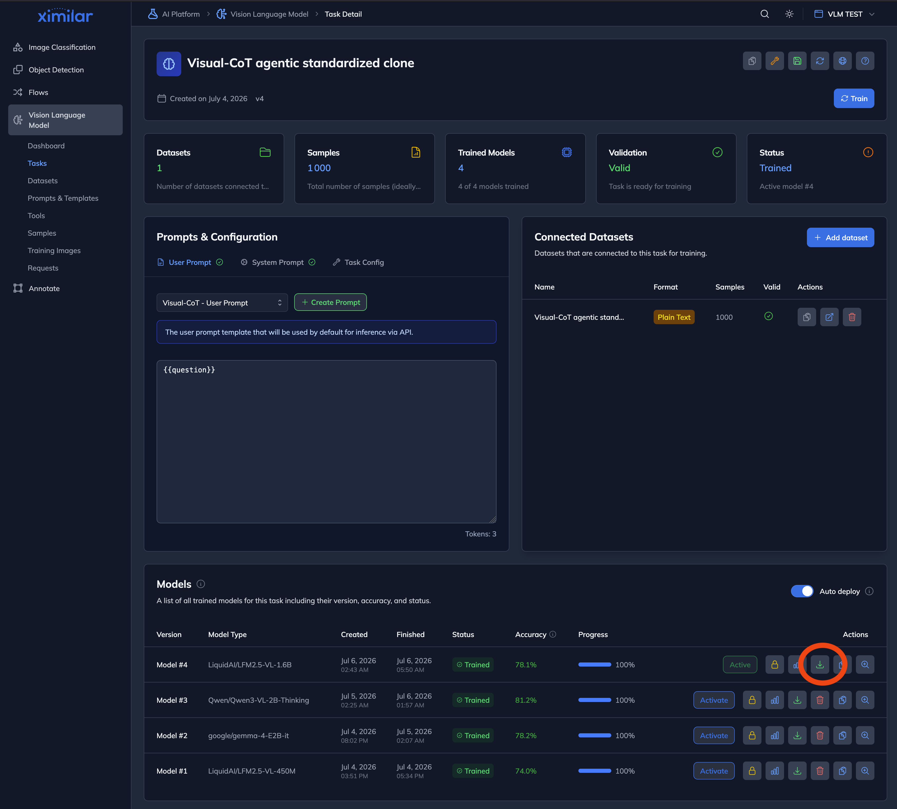
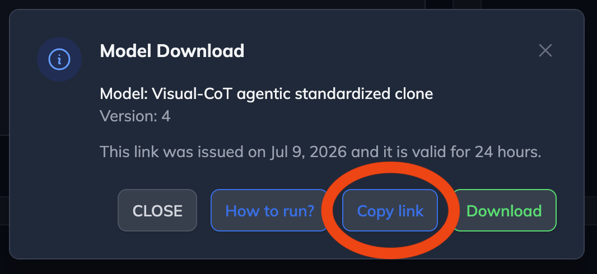

# Ximilar VLM Scripts — Transformers

Simple inference scripts for running your trained VLM (Vision-Language) models from the [Ximilar Platform](https://www.ximilar.com) using HuggingFace Transformers.

Each model has its own `run.py` script. There are no command-line arguments — you configure everything by editing the constants at the top of the script (prompt, image paths, tools, generation settings), and the model itself is **downloaded automatically** on first run from a URL you provide in an environment variable.

Your model can be:

- **LoRA adapter** (`.safetensors`) — on top of a base model from HuggingFace
- **Full model** (`.safetensors`) — fully fine-tuned weights
- **Full model** (`.pt`) — PyTorch state_dict export

The scripts auto-detect the format from the model directory and handle all three automatically.

## Supported Models

| Model                   | Script                                                                   | Env variable                          | Base Model (HuggingFace)                                                      |
|-------------------------|--------------------------------------------------------------------------|----------------------------------------|-------------------------------------------------------------------------------|
| LiquidAI LFM2-VL-450M   | [models/LFM2-VL-450M/run.py](models/LFM2-VL-450M/run.py)                 | `MODEL_URL_HF_LFM2_VL_450M`            | [LiquidAI/LFM2-VL-450M](https://huggingface.co/LiquidAI/LFM2-VL-450M)         |
| LiquidAI LFM2-VL-1.6B   | [models/LFM2-VL-1.6B/run.py](models/LFM2-VL-1.6B/run.py)                 | `MODEL_URL_HF_LFM2_VL_1_6B`            | [LiquidAI/LFM2-VL-1.6B](https://huggingface.co/LiquidAI/LFM2-VL-1.6B)         |
| LiquidAI LFM2-VL-3B     | [models/LFM2-VL-3B/run.py](models/LFM2-VL-3B/run.py)                     | `MODEL_URL_HF_LFM2_VL_3B`              | [LiquidAI/LFM2-VL-3B](https://huggingface.co/LiquidAI/LFM2-VL-3B)             |
| LiquidAI LFM2.5-VL-450M | [models/LFM2.5-VL-450M/run.py](models/LFM2.5-VL-450M/run.py)             | `MODEL_URL_HF_LFM2_5_450M`             | [LiquidAI/LFM2.5-VL-450M](https://huggingface.co/LiquidAI/LFM2.5-VL-450M)     |
| LiquidAI LFM2.5-VL-1.6B | [models/LFM2.5-VL-1.6B/run.py](models/LFM2.5-VL-1.6B/run.py)             | `MODEL_URL_HF_LFM2_5_1_6B`             | [LiquidAI/LFM2.5-VL-1.6B](https://huggingface.co/LiquidAI/LFM2.5-VL-1.6B)     |
| Google Gemma 3 4B PT    | [models/gemma-3-4b-pt/run.py](models/gemma-3-4b-pt/run.py)               | `MODEL_URL_HF_GEMMA_3_4B_PT`           | [google/gemma-3-4b-pt](https://huggingface.co/google/gemma-3-4b-pt)           |
| Google Gemma 3 4B       | [models/gemma-3-4b-it/run.py](models/gemma-3-4b-it/run.py)               | `MODEL_URL_HF_GEMMA_3_4B_IT`           | [google/gemma-3-4b-it](https://huggingface.co/google/gemma-3-4b-it)           |
| Google Gemma 4 E2B      | [models/gemma-4-E2B-it/run.py](models/gemma-4-E2B-it/run.py)             | `MODEL_URL_HF_GEMMA_4_E2B_IT`          | [google/gemma-4-E2B-it](https://huggingface.co/google/gemma-4-E2B-it)         |
| Qwen3-VL 2B             | [models/Qwen3-VL-2B-Instruct/run.py](models/Qwen3-VL-2B-Instruct/run.py) | `MODEL_URL_HF_QWEN3_VL_2B_INSTRUCT`    | [Qwen/Qwen3-VL-2B-Instruct](https://huggingface.co/Qwen/Qwen3-VL-2B-Instruct) |
| Qwen3-VL 4B             | [models/Qwen3-VL-4B-Instruct/run.py](models/Qwen3-VL-4B-Instruct/run.py) | `MODEL_URL_HF_QWEN3_VL_4B_INSTRUCT`    | [Qwen/Qwen3-VL-4B-Instruct](https://huggingface.co/Qwen/Qwen3-VL-4B-Instruct) |

Some checkpoints also support **agentic** inference — thinking + tool calls, not just an answer. See [Agentic Models](#agentic-models) below.

## Requirements

- Python 3.12+
- NVIDIA GPU recommended (CUDA 12.x) — CPU and Apple Silicon (MPS) also work

### Library versions

| Library      | Version   |
|--------------|-----------|
| torch        | >= 2.10.0 |
| transformers | >= 5.1.0  |
| peft         | >= 0.18.1 |
| accelerate   | >= 1.12.0 |
| safetensors  | >= 0.7.0  |
| pillow       | >= 10.0   |

## Setup

From the `transformers/` directory:

```bash
# Install uv (fast Python package manager)
curl -LsSf https://astral.sh/uv/install.sh | sh

# Create/update the virtual environment and install dependencies from pyproject.toml
uv sync
```

### HuggingFace authentication (required for some models)

Some base models (e.g. **google/gemma-3-4b-it**) are gated — you must accept the license on HuggingFace and authenticate before the base model can be downloaded (needed when your model is a LoRA adapter):

1. Go to the model page (e.g. [google/gemma-3-4b-it](https://huggingface.co/google/gemma-3-4b-it)) and accept the license agreement
2. Create an access token at [huggingface.co/settings/tokens](https://huggingface.co/settings/tokens)
3. Authenticate:

```bash
export HF_TOKEN=hf_your_token_here
```

## Environment variables

| Variable | Required | Description |
|---|---|---|
| `MODEL_DOWNLOAD_DIRECTORY` | **Yes** | Base directory where models are downloaded and extracted. Each model gets its own subfolder named after the model (e.g. `./stored/LFM2.5-VL-1.6B/`). |
| `MODEL_URL_HF_<MODEL>` | **Yes** (first run) | The model's download URL — one variable per model, listed in the tables below (e.g. `MODEL_URL_HF_LFM2_5_450M`). Copy it from the model details page at https://app.ximilar.com/platform/vlm/tasks/; the link is valid for 24 hours. Not needed again once the model is downloaded. |
| `HF_TOKEN` | For gated base models | HuggingFace access token, needed when your model is a LoRA adapter on a gated base model (e.g. `google/gemma-*`) so the base weights can be fetched. See [HuggingFace authentication](#huggingface-authentication-required-for-some-models). |
| `PYTORCH_ENABLE_MPS_FALLBACK` | LFM2.5 on Apple Silicon | Set to `1` before Python starts to run `LiquidAI/LFM2.5-VL-*` models on MPS (they use ops MPS doesn't implement). |

```bash
export MODEL_DOWNLOAD_DIRECTORY=./stored
export MODEL_URL_HF_LFM2_5_1_6B='https://...'
export HF_TOKEN=hf_...                      # only for gated base models (gemma)
```

## Usage

1. Open your task at **https://app.ximilar.com/platform/vlm/tasks/**, pick the trained model, and click its **download** action:

   

2. In the dialog, click **Copy link** — note the link is valid for **24 hours** (re-copy a fresh one when it expires):

   

3. Export **`MODEL_DOWNLOAD_DIRECTORY`** (required — the base directory where models are downloaded and extracted; each model gets its own subfolder named after the model) and the copied URL as the env variable listed in the tables above, then run the script for your model from the `transformers/` directory.

```bash
export MODEL_DOWNLOAD_DIRECTORY=./stored
export MODEL_URL_HF_LFM2_5_1_6B='https://...'
uv run models/LFM2.5-VL-1.6B/run.py
```

On the first run the model archive is downloaded and extracted into `$MODEL_DOWNLOAD_DIRECTORY/<model-name>/` (e.g. `./stored/LFM2.5-VL-1.6B/`); later runs reuse it and skip the download.

To change what the script does, **edit the constants at the top of the script**:

```python
IMAGES = ["media/photo.jpg"]  # local image paths, relative to the transformers/ directory
USER_PROMPT = "Describe the product in the image."
SYSTEM_PROMPT = None
MAX_TOKENS = 256
TEMPERATURE = 0.0  # 0.0 = greedy
RESIZE = None      # max image dimension in px, None = keep original size
DEBUG = False      # True prints token counts, timing, and the rendered prompt
```

A sample image ships at [media/photo.jpg](media/photo.jpg); point `IMAGES` at your own local files to test your data.

On Apple Silicon, `LiquidAI/LFM2.5-VL-*` models require explicit MPS CPU fallback opt-in before Python starts:

```bash
PYTORCH_ENABLE_MPS_FALLBACK=1 uv run models/LFM2.5-VL-1.6B/run.py
```

## How it works

The script auto-detects the model format from the directory contents:

1. **LoRA adapter**: If `adapter_config.json` is found, it downloads the base model from HuggingFace and applies your LoRA weights on top.
2. **Full model (.pt)**: If `model.pt` is found, it loads the PyTorch state_dict via `torch.load()` and builds the model from `config.json`.
3. **Full model (safetensors)**: Otherwise, it loads `.safetensors` weights directly via `from_pretrained()`.

The base model (for LoRA) is automatically cached in `~/.cache/huggingface/hub` after the first download.

### Image processing and tiling

Each model family handles images differently:

| Model                    | Image handling                                                                                                                                    |
|--------------------------|---------------------------------------------------------------------------------------------------------------------------------------------------|
| **Liquid (LFM2/LFM2.5)** | Image tiling (`do_image_splitting`) with token budget (`min_image_tokens`, `max_image_tokens`). Splits large images into tiles for better detail. |
| **Gemma 3**              | Fixed resolution, no tiling.                                                                                                                      |
| **Qwen3-VL**             | Dynamic resolution — images are rescaled to fit within a pixel budget while preserving aspect ratio.                                              |

**Important**: Your model's training settings are always respected. If your model was trained with `do_image_splitting=False`, the script detects this from the saved `preprocessor_config.json` and does not override it. Default processor kwargs (like tiling) are only applied when the model's own config doesn't specify them.

## Agentic Models

Some fine-tuned checkpoints are **agentic**: instead of only producing a final answer, they emit **thinking** and **tool calls** alongside it. These are run through `agentic.py` instead of `base.py` — the script parses the raw generation into separate Thinking / Tool calls / Answer sections instead of printing raw text.

| Model                   | Script                                                                   | Env variable                          | Base Model (HuggingFace)                                                       |
|--------------------------|---------------------------------------------------------------------------|----------------------------------------|----------------------------------------------------------------------------------|
| Qwen3-VL 2B Thinking     | [models/Qwen3-VL-2B-Thinking/run.py](models/Qwen3-VL-2B-Thinking/run.py)  | `MODEL_URL_HF_QWEN3_VL_2B_THINKING`    | [Qwen/Qwen3-VL-2B-Thinking](https://huggingface.co/Qwen/Qwen3-VL-2B-Thinking)     |
| Qwen3-VL 4B Thinking     | [models/Qwen3-VL-4B-Thinking/run.py](models/Qwen3-VL-4B-Thinking/run.py)  | `MODEL_URL_HF_QWEN3_VL_4B_THINKING`    | [Qwen/Qwen3-VL-4B-Thinking](https://huggingface.co/Qwen/Qwen3-VL-4B-Thinking)     |
| LiquidAI LFM2.5-VL-450M  | [models/LFM2.5-VL-450M/run_agentic.py](models/LFM2.5-VL-450M/run_agentic.py) | `MODEL_URL_HF_LFM2_5_450M`         | [LiquidAI/LFM2.5-VL-450M](https://huggingface.co/LiquidAI/LFM2.5-VL-450M) |
| LiquidAI LFM2.5-VL-1.6B  | [models/LFM2.5-VL-1.6B/run_agentic.py](models/LFM2.5-VL-1.6B/run_agentic.py) | `MODEL_URL_HF_LFM2_5_1_6B`         | [LiquidAI/LFM2.5-VL-1.6B](https://huggingface.co/LiquidAI/LFM2.5-VL-1.6B) |
| Google Gemma 4 E2B       | [models/gemma-4-E2B-it/run_agentic.py](models/gemma-4-E2B-it/run_agentic.py) | `MODEL_URL_HF_GEMMA_4_E2B_IT`      | [google/gemma-4-E2B-it](https://huggingface.co/google/gemma-4-E2B-it)     |

LFM2.5-VL and Gemma 4 checkpoints work with either entrypoint against the same downloaded model directory: `run.py` for a plain prompt without tools, `run_agentic.py` for tool calling with a simulated tool round. Both parse the output with the same response schema — the fine-tuned checkpoint may or may not emit thinking/tool-call markers, and `run.py` handles both: markers are parsed into Thinking / Tool calls / Answer sections when present, and a plain response simply becomes the Answer.

### Wire formats

Each family emits thinking and tool calls in its own format. Parsing uses HuggingFace's native `tokenizer.parse_response()` (transformers >= 5.1), driven by per-family response schemas defined in `agentic.py` — ported from the training pipeline and attached to the tokenizer automatically (checkpoints that ship their own `response_schema` in `tokenizer_config.json` are used as-is):

| Family (the `FAMILY` constant in each agentic script) | Thinking                        | Tool calls                                                                                                |
|-------------------------------------------------------|----------------------------------|--------------------------------------------------------------------------------------------------------------|
| `qwen3vl` (Qwen3-VL-\*-Thinking)                       | `<think>...</think>`            | `<tool_call>{"name": ..., "arguments": {...}}</tool_call>` (JSON)                                            |
| `lfm2.5` (LFM2.5-VL-\*)                                | `<think>...</think>`            | `<\|tool_call_start\|>[name(arg=val, ...)]<\|tool_call_end\|>` (Python-call syntax)                          |
| `gemma4` (gemma-4-E2B-it)                              | `<\|channel>thought...<channel\|>` | `<\|tool_call>call:name{key:value,...}<tool_call\|>` (custom syntax — string values are quoted with the literal token `<\|"\|>`, a real added token in Gemma 4's tokenizer, instead of `"`) |

### Usage

Same flow as the answer-only scripts — export the env variable and run:

```bash
export MODEL_URL_HF_QWEN3_VL_2B_THINKING='https://...'
uv run models/Qwen3-VL-2B-Thinking/run.py
```

Tools are defined in the `TOOLS` constant at the top of the script — a list of `{"name", "description", "parameters"}` objects (`parameters` is a JSON Schema object). Replace the example `submit_product_classification` tool with your own definitions. Agentic scripts also have `ENABLE_THINKING` (**gemma-4 only** — LFM2.5 and Qwen3-VL-Thinking always think) and `SHOW_RAW` (also print the undecoded raw generation) constants.

The agentic models expect their tool calls to really be executed. The examples can't do that, so when the model calls a tool, the script feeds back a **prepared simulated result** from the `SIMULATED_TOOL_RESULTS` constant (per tool name; a result can optionally carry `"images": ["local/path.jpg"]` to attach media) and runs the model **once more** to produce its final answer:

```
Output (turn 1):
--- Thinking ---
...model's reasoning...

--- Tool calls (1) ---
  submit_product_classification({"category": "shoes", "price": 29.99, "weight": 1.2})

--- Answer ---
(none)

Output (turn 2 - final answer after simulated tool result):
--- Answer ---
...final text answer, produced after the model saw the simulated tool result...
```

### Scope: simulated tools, single round

These scripts do **not** execute real tools — the tool result the model sees comes from the `SIMULATED_TOOL_RESULTS` constant, and only one simulated round runs (if the model calls a tool again in turn 2, the script stops there). Replace the simulated results with a real tool-execution loop on top of `agentic.run_agentic_inference()` / `agentic.parse_agentic()` / `agentic.append_simulated_tool_results()` if you need full agent behavior.

A malformed or truncated generation never crashes the script: `parse_agentic()` always returns a `ParsedGeneration`, with `finish_reason="parse_error"` and the error listed when something couldn't be parsed. Note that `parse_response()` is all-or-nothing — one malformed tool call fails the whole parse rather than being skipped individually.

### gemma-4-E2B-it specifics

- Loads via `AutoModelForMultimodalLM` (not `AutoModelForImageTextToText`) and requires `padding_side="left"`.
- All agentic generations decode with `skip_special_tokens=False` so markers like `<think>`, `<|tool_call_start|>`, and `<|channel>` survive for parsing — this is also why `SHOW_RAW` output for gemma-4 looks unusually verbose (channel/turn markers, plus the literal `<|"|>` string-quote token from its tool-call syntax).

## Troubleshooting

### Model download: "Environment variable ... is not set"

The run scripts download your model automatically. Two env variables are required: `MODEL_DOWNLOAD_DIRECTORY` (base directory for all downloaded models, one subfolder per model) and the script's `MODEL_URL_ENV` variable (the download URL — copy it from your model's details page at https://app.ximilar.com/platform/vlm/tasks/; the link is valid for 24 hours). To re-download a model (e.g. after re-training), delete its subfolder under `$MODEL_DOWNLOAD_DIRECTORY`.

### Gemma 3: NaN / inf errors during generation

```
RuntimeError: probability tensor contains either `inf`, `nan` or element < 0
```

This is a known issue with Gemma 3 models caused by multiple bugs in the transformers library:

- **SDPA attention + padding** produces NaN on CPU/MPS. Fix: we use `attn_implementation="eager"` by default.
- **float16 overflow** in RMSNorm layers. Fix: we use `bfloat16` by default, which matches the model's training precision.
- **float32 embedding scale mismatch** — the model was trained with bfloat16-rounded scale values, so float32 produces slightly different logits that accumulate into NaN.

If you still see this error, set `TEMPERATURE = 0.0` in the script (greedy decoding, no sampling).

### MPS (Apple Silicon): Out of memory

```
RuntimeError: Invalid buffer size: 8.01 GiB
```

MPS cannot allocate large contiguous memory blocks. The scripts load models on CPU first, then move to MPS incrementally. However, larger models (4B+) may still exceed available GPU memory.

### LFM2.5 on Apple Silicon: explicit MPS fallback required

`LiquidAI/LFM2.5-VL-*` models can hit MPS -> CPU fallback ops during image preprocessing. The scripts do not enable that fallback automatically — set the env var yourself before Python starts:

```bash
PYTORCH_ENABLE_MPS_FALLBACK=1 uv run models/LFM2.5-VL-1.6B/run.py
```

### MPS: Slow or stuck generation

Generation on MPS can appear stuck for larger models — it's not frozen, just slow. Vision models are especially heavy because the image encoder runs before text generation.

Tips (constants in the script):

- Set `RESIZE = 384` to reduce image size and speed up processing
- Set `MAX_TOKENS = 50` for quick tests

**Recommended**: Models up to ~2B parameters work well on MPS. For 4B+ models, use CPU or a CUDA GPU.

### Gated models: "does not appear to have a file named model.safetensors"

```
OSError: google/gemma-3-4b-it does not appear to have a file named model.safetensors
```

This means HuggingFace authentication failed. The error message is misleading — the files exist but you don't have access. See the [HuggingFace authentication](#huggingface-authentication-required-for-some-models) section above.

Common causes:

- `HF_TOKEN` not set in your shell
- Token is a **fine-grained** token without read access — use a **Read** token instead
- License not accepted on the model's HuggingFace page

### LoRA + Gemma 3: Very slow on CPU

Gemma 3 (4B parameters) with a LoRA adapter on CPU is very slow — expect **5-15 minutes** per generation with images. For faster results:

- Use a **CUDA GPU** — this is how Gemma 3 is meant to run
- Use **Liquid LFM2-VL-450M** on CPU — 10x smaller and much faster
- Set `RESIZE = 384` to reduce image processing time
- Test text-only first (set `IMAGES = []`) to verify the model works

### General: `torch_dtype` deprecation warning

```
`torch_dtype` is deprecated! Use `dtype` instead!
```

This is a harmless warning from transformers >= 5.x. The parameter still works. You can safely ignore it.

## Project structure

```
transformers/
├── base.py                    # Shared utilities: model download, loading, images, inference
├── agentic.py                 # Agentic add-on: response schemas, parse_response parsing, tool calls
├── client.py                  # Ximilar backend download client (used by base.ensure_model)
├── media/photo.jpg         # Sample image used by the run scripts
├── models/<MODEL>/run.py      # One constants-based example script per model
├── models/<MODEL>/run_agentic.py  # Agentic variant (LFM2.5, gemma-4)
└── tests/test_agentic.py      # The single test file (offline, no model weights needed)
```

Models are downloaded into `$MODEL_DOWNLOAD_DIRECTORY/<model-name>/` (one subfolder per model).

Every run script depends only on `base.py` (+ `agentic.py` for agentic models); `client.py` is used internally by `base.py` for the model download. Copy the script, keep those files next to it, and it fully works.
